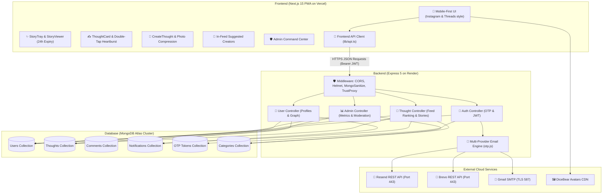

# 🚀 ThoughtShare — Complete Full-Stack Social PWA Architecture & Documentation (A to Z)

**ThoughtShare** is a production-ready, mobile-first **Progressive Web App (PWA)** and social publishing platform built with **Next.js 15 + React 19 + TypeScript** on the frontend and **Node.js + Express 5 + MongoDB** on the backend.

- 🌐 **Live Web App (Vercel)**: [https://share-your-thought-eight.vercel.app/](https://share-your-thought-eight.vercel.app/)
- ⚙️ **Live Backend API (Render)**: [https://shareyourthought-1.onrender.com](https://shareyourthought-1.onrender.com)
- 📦 **GitHub Repository**: [https://github.com/muzamilCodes/ShareYourThought](https://github.com/muzamilCodes/ShareYourThought)

---

## 📑 Table of Contents
1. [System Architecture & Full-Stack Relationship](#1-system-architecture--full-stack-relationship)
2. [Tech Stack Breakdown](#2-tech-stack-breakdown)
3. [Repository Directory Structure](#3-repository-directory-structure)
4. [Database Models & Mongoose Schemas](#4-database-models--mongoose-schemas)
5. [Frontend & Backend Interaction Flow](#5-frontend--backend-interaction-flow)
6. [Key Features & Subsystems](#6-key-features--subsystems)
   - [24-Hour Story Sparks & In-Story Deletion](#24-hour-story-sparks)
   - [Multi-Tier Algorithmic Feed Ranking](#multi-tier-algorithmic-feed-ranking)
   - [Email Deliverability Engine (Resend + Brevo + SMTP)](#email-deliverability-engine)
   - [In-Feed Suggested Creators](#in-feed-suggested-creators)
   - [Admin Command Center & Moderation](#admin-command-center)
   - [Progressive Web App (PWA) Capabilities](#progressive-web-app-pwa-capabilities)
7. [Complete REST API Reference](#7-complete-rest-api-reference)
8. [Environment Variables Reference](#8-environment-variables-reference)
9. [Local Development Setup Guide](#9-local-development-setup-guide)
10. [Cloud Deployment Guide (Vercel + Render)](#10-cloud-deployment-guide)

---

## 1. System Architecture & Full-Stack Relationship

The ThoughtShare ecosystem is split into two independent, decoupled services:



---

## 2. Tech Stack Breakdown

### 🎨 Frontend (`/frontend`)
- **Framework**: [Next.js 15](https://nextjs.org/) (App Router, Server Components & Client Hydration)
- **UI Engine**: [React 19](https://react.dev/) + [TypeScript](https://www.typescriptlang.org/)
- **Styling**: Vanilla CSS Design Tokens with Dark Mode support (`[data-theme='dark']`)
- **PWA Capabilities**: Service Worker (`sw.js`), Web Manifest (`manifest.json`), Offline Fallback (`/offline`), Install Prompts
- **Image Processing**: Client-side HTML5 Canvas compression (`imageUtils.ts`) for instant camera & photo uploads
- **Audio & Haptics**: Synthesized Web Audio UI sounds (`soundUtils.ts`)

### 🛠️ Backend (`/backend`)
- **Runtime**: [Node.js](https://nodejs.org/) (ES Modules)
- **Server Framework**: [Express 5](https://expressjs.com/)
- **Database ODM**: [MongoDB](https://www.mongodb.com/) with [Mongoose 8](https://mongoosejs.com/)
- **Authentication**: Stateless JSON Web Tokens (JWT) + 6-digit Email OTP Verification
- **Email Engine**: Multi-Provider Architecture (Resend REST API -> Brevo REST API -> Gmail/SMTP pool)
- **Security**: Helmet, Express NoSQL Injection Sanitizer, Trust Proxy 1, CORS reflections, Morgan logger

---

## 3. Repository Directory Structure

```bash
ShareYourThought/
├── backend/
│   ├── src/
│   │   ├── config/               # DB connection (db.js) and env validator (env.js)
│   │   ├── controllers/          # Business logic (thoughts, auth, users, admin, comments)
│   │   ├── middleware/           # auth.js (JWT verify), errorHandler.js, notFound.js
│   │   ├── models/               # Mongoose Schemas (User, Thought, Comment, Notification, OtpToken)
│   │   ├── routes/               # Express route declarations
│   │   ├── utils/                # otp.js (Mailer), notifications.js, paginate.js
│   │   ├── app.js                # Express app initialization & route mounting
│   │   └── server.js             # HTTP server entry point
│   ├── package.json
│   └── README.md                 # Backend detailed documentation
├── frontend/
│   ├── app/                      # Next.js 15 App Router pages & layouts
│   ├── components/               # Reusable UI components (StoryTray, ThoughtCard, Navbar)
│   ├── hooks/                    # useSession.ts hook
│   ├── lib/                      # api.ts (HTTP client), imageUtils.ts, soundUtils.ts
│   ├── public/                   # manifest.json, sw.js, app icons
│   ├── package.json
│   └── README.md                 # Frontend detailed documentation
└── README.md                     # Master project documentation
```

---

## 4. Database Models & Mongoose Schemas

### 1. `Thought` Model (`backend/src/models/Thought.js`)
```javascript
{
  author: { type: mongoose.Schema.Types.ObjectId, ref: 'User', required: true },
  content: { type: String, required: true, trim: true, maxlength: 2000 },
  imageUrl: { type: String, default: '' },
  category: { type: String, default: 'life', lowercase: true, index: true },
  hashtags: [{ type: String, lowercase: true, trim: true }],
  visibility: { type: String, enum: ['public', 'followers'], default: 'public' },
  likes: [{ type: mongoose.Schema.Types.ObjectId, ref: 'User' }],
  viewsCount: { type: Number, default: 0, index: true },
  sharesCount: { type: Number, default: 0 },
  featured: { type: Boolean, default: false },
  
  // 24-Hour Story Spark Fields
  isStory: { type: Boolean, default: false, index: true },
  storyExpiresAt: { type: Date, default: null, index: true },
  gradient: { type: String, default: '' }
}
```

### 2. `User` Model (`backend/src/models/User.js`)
```javascript
{
  name: { type: String, required: true, trim: true },
  username: { type: String, required: true, unique: true, lowercase: true, trim: true },
  email: { type: String, required: true, unique: true, lowercase: true, trim: true },
  password: { type: String, required: true, select: false },
  avatar: { type: String, default: '' },
  bio: { type: String, default: '', maxlength: 500 },
  role: { type: String, enum: ['user', 'admin'], default: 'user' },
  isPrivate: { type: Boolean, default: false },
  followers: [{ type: mongoose.Schema.Types.ObjectId, ref: 'User' }],
  following: [{ type: mongoose.Schema.Types.ObjectId, ref: 'User' }],
  followRequests: [{ type: mongoose.Schema.Types.ObjectId, ref: 'User' }],
  savedThoughts: [{ type: mongoose.Schema.Types.ObjectId, ref: 'Thought' }]
}
```

---

## 5. Frontend & Backend Interaction Flow

1. **Authentication Handshake**:
   - Client calls `POST /api/auth/send-register-otp` with `{ email, name, password }`.
   - Backend generates a 6-digit code, stores it in `OtpToken` with 10-minute TTL, and sends it via Resend / Brevo API.
   - User inputs OTP in client -> client calls `POST /api/auth/verify-register-otp`.
   - Backend verifies OTP, creates user, issues signed JWT token, and returns user object.
   - Frontend stores token in `localStorage` and updates global session context.

2. **Feed Fetching & Dynamic Ranking**:
   - Client calls `GET /api/thoughts?sort=trending` passing `Bearer <token>`.
   - Backend excludes `{ isStory: true }` so stories never pollute the feed.
   - Backend boosts author's own posts (Tier 3) and followed creators (Tier 2) to the top of the feed stream.
   - On page refresh, discovery thoughts rotate dynamically.

3. **Story Sparks Lifecycle**:
   - User clicks `+` on Story Tray -> attaches a photo or picks a gradient -> submits with `isStory: true`.
   - Backend saves thought with `isStory: true` and `storyExpiresAt: new Date(Date.now() + 24*3600*1000)`.
   - StoryTray fetches active stories from `GET /api/thoughts/stories/active`.
   - After 24 hours, stories automatically disappear from the tray.
   - Users can delete their active story directly in `StoryViewer` using the custom in-story confirmation modal.

---

## 6. Key Features & Subsystems

### 24-Hour Story Sparks
- Full-screen interactive story player with auto-progressing segments (5 seconds per story).
- Direct mobile camera/gallery photo upload with instant client compression.
- 5 preset vibrant gradients (`Sunset Ember`, `Twilight`, `Ocean Wave`, `Emerald Forest`, `Velvet Dark`).
- Double-tap likes, reaction bursts (`❤️`, `🔥`, `👏`, `💡`, `💯`, `✨`), and threaded replies.
- Dedicated in-story **`🗑️ Delete`** modal with instant reactive state update.

### Multi-Tier Algorithmic Feed Ranking
- **Tier 3**: Author's own posts rank #1 for themselves.
- **Tier 2**: Followed creators rank top priority for their followers.
- **Tier 1**: General discovery posts ranked by time-decay gravity:
  $$\text{Score} = \frac{(\text{Likes} \times 5) + (\text{Comments} \times 4) + (\text{Saves} \times 4) + (\text{Views} \times 1)}{(\text{Age in Hours} + 2)^{1.3}}$$

### In-Feed Suggested Creators
- Appears seamlessly after the 2nd thought in the feed stream.
- Automatically filters out creators you already follow.
- Includes a clean `✕` dismiss button.

### Admin Command Center (`/admin`)
- Accessible exclusively by platform admins (`role === 'admin'`).
- Live metrics: Total Users, Total Thoughts, Total Views, Likes, Shares, Categories.
- Interactive User Management table: Search creators, filter by role, promote to Admin, demote to User, or permanently delete accounts with cascading thought cleanup.

---

## 7. Complete REST API Reference

| Method | Endpoint | Description | Auth Required |
|---|---|---|---|
| `POST` | `/api/auth/send-register-otp` | Sends 6-digit registration OTP to email | No |
| `POST` | `/api/auth/verify-register-otp`| Verifies OTP and returns signed JWT | No |
| `POST` | `/api/auth/send-login-otp` | Sends passwordless login OTP | No |
| `POST` | `/api/auth/verify-login-otp` | Verifies login OTP | No |
| `POST` | `/api/auth/login` | Traditional email + password login | No |
| `GET` | `/api/auth/me` | Current authenticated user profile | Yes |
| `GET` | `/api/thoughts?sort=trending` | Universal feed sorted by trending/views/newest | Optional |
| `GET` | `/api/thoughts/stories/active` | Active 24-hour stories only | Optional |
| `POST` | `/api/thoughts` | Create thought or 24-hour Story Spark | Yes |
| `GET` | `/api/thoughts/:id` | Get single thought with author details | Optional |
| `PATCH`| `/api/thoughts/:id` | Edit thought content/category | Yes |
| `DELETE`| `/api/thoughts/:id` | Delete thought or story permanently | Yes |
| `POST` | `/api/thoughts/:id/view` | Increments thought views count | No |
| `POST` | `/api/thoughts/:id/like` | Like or unlike thought | Yes |
| `POST` | `/api/thoughts/:id/save` | Bookmark / save thought | Yes |
| `GET` | `/api/users/:username` | User profile with thoughts stream | Optional |
| `GET` | `/api/users/suggested` | Suggested creator recommendations | Optional |
| `POST` | `/api/follows/:userId` | Follow or unfollow user | Yes |
| `GET` | `/api/admin/stats` | Admin platform metrics & timeline | Admin |
| `GET` | `/api/admin/users` | Admin user management table | Admin |
| `PATCH`| `/api/admin/users/:id/role`| Promote user to Admin or demote to User | Admin |
| `DELETE`| `/api/admin/users/:id` | Admin delete user account | Admin |

---

## 8. Environment Variables Reference

### Backend (`backend/.env`)
```env
PORT=5000
NODE_ENV=production
MONGO_URI=mongodb+srv://<username>:<password>@cluster0.mongodb.net/thoughtshare?retryWrites=true&w=majority
JWT_SECRET=your_jwt_secret_key_here
JWT_EXPIRES_IN=30d
CLIENT_URL=https://share-your-thought-eight.vercel.app

# Email Provider Configuration
RESEND_API_KEY=re_xxxxxxxxxxxxxxxxxxxxxxxx
BREVO_API_KEY=xkeysib-xxxxxxxxxxxxxxxxxxxx
EMAIL_FROM=ThoughtShare <onboarding@resend.dev>

# Optional SMTP
SMTP_HOST=smtp.gmail.com
SMTP_PORT=587
SMTP_USER=your_email@gmail.com
SMTP_PASS=your_app_password
```

### Frontend (`frontend/.env.local`)
```env
NEXT_PUBLIC_API_URL=https://shareyourthought-1.onrender.com/api
NEXT_PUBLIC_APP_URL=https://share-your-thought-eight.vercel.app
```

---

## 9. Local Development Setup Guide

### Prerequisites
- Node.js 18+ installed
- MongoDB instance (local or MongoDB Atlas)

### Step 1: Clone Repository
```bash
git clone https://github.com/muzamilCodes/ShareYourThought.git
cd ShareYourThought
```

### Step 2: Configure & Start Backend
```bash
cd backend
npm install
# Create .env file with your MONGO_URI and JWT_SECRET
npm run dev
```
Backend starts on `http://localhost:5000`.

### Step 3: Configure & Start Frontend
```bash
cd ../frontend
npm install
# Set NEXT_PUBLIC_API_URL=http://localhost:5000/api in .env.local
npm run dev
```
Frontend opens on `http://localhost:3000`.

---

## 10. Cloud Deployment Guide

### Deploy Backend on Render:
1. Link your GitHub repository on [Render](https://render.com).
2. Choose **Web Service**, set Root Directory to `backend`.
3. Build Command: `npm install`
4. Start Command: `npm start`
5. Add all backend `.env` variables under the **Environment** tab.

### Deploy Frontend on Vercel:
1. Import your GitHub repository on [Vercel](https://vercel.com).
2. Set Root Directory to `frontend`.
3. Add `NEXT_PUBLIC_API_URL` pointing to your Render backend URL (e.g. `https://shareyourthought-1.onrender.com/api`).
4. Click **Deploy**.
