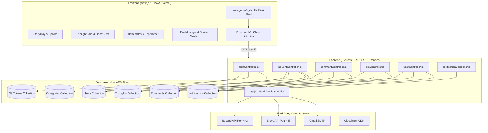
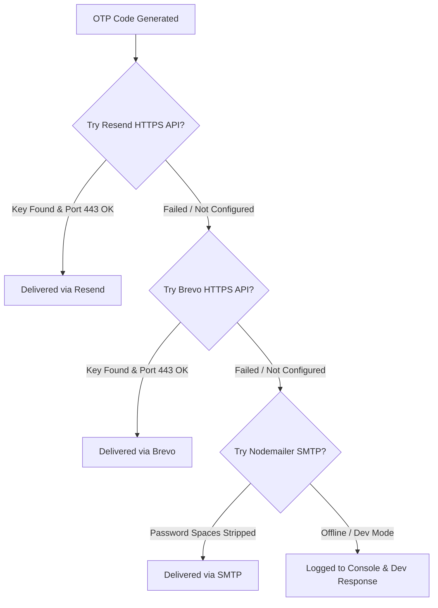

# 🚀 ThoughtShare — Complete Full-Stack PWA Architecture & Documentation (A to Z)

**ThoughtShare** is a modern, high-performance, mobile-first **Progressive Web App (PWA)** and editorial social platform where users can publish thoughts, share photos from mobile camera/gallery, discover trending topics, interact with Instagram-style stories & double-tap likes, and connect through real conversations.

- 🌐 **Live Web App (Vercel)**: [https://share-your-thought-eight.vercel.app/](https://share-your-thought-eight.vercel.app/)
- ⚙️ **Live Backend API (Render)**: [https://shareyourthought-1.onrender.com](https://shareyourthought-1.onrender.com)

---

## 📑 Table of Contents
1. [Tech Stack](#1-tech-stack)
2. [Full System Architecture & Relations](#2-full-system-architecture--relations)
3. [Database Schema & Models (A to Z)](#3-database-schema--models-a-to-z)
4. [Backend API Reference & Endpoints](#4-backend-api-reference--endpoints)
5. [Frontend Architecture & Components](#5-frontend-architecture--components)
6. [Instagram-Style & PWA Features](#6-instagram-style--pwa-features)
7. [Email Deliverability Engine (Resend + Brevo + SMTP)](#7-email-deliverability-engine)
8. [Trending Algorithm (Gravity Formula)](#8-trending-algorithm)
9. [Environment Variables Configuration](#9-environment-variables-configuration)
10. [Local Development & Deployment Guide](#10-local-development--deployment-guide)

---

## 1. Tech Stack

### 🎨 Frontend (Client-Side)
- **Framework**: [Next.js 15 (App Router)](https://nextjs.org/) + [React 19](https://react.dev/) + [TypeScript](https://www.typescriptlang.org/)
- **Design System**: Vanilla CSS tokens (`--sand`, `--ember`, `--ink`, `--paper`, `--line`) with system & user Dark Mode (`[data-theme='dark']`)
- **PWA Capabilities**: Service Worker (`sw.js`), Web App Manifest (`manifest.json`), Offline Fallback (`/offline`), Install Prompts, Push Notification handlers
- **Image Processing**: Client-side HTML5 Canvas compression (`imageUtils.ts`) for instant camera & photo uploads

### 🛠️ Backend (Server-Side)
- **Runtime & Server**: [Node.js](https://nodejs.org/) (ES Modules) + [Express 5](https://expressjs.com/)
- **Database**: [MongoDB](https://www.mongodb.com/) with [Mongoose 8 ODM](https://mongoosejs.com/)
- **Authentication**: JWT (JSON Web Tokens) with HttpOnly secure cookies + 6-digit Email OTP verification
- **Email Delivery**: Multi-Provider Engine (Resend HTTPS REST API, Brevo REST API, Gmail/Hostinger SMTP with connection pooling)
- **Security & Middleware**: Helmet, Express Mongo Sanitize, Rate Limiter, CORS, Morgan logging

---

## 2. Full System Architecture & Relations



---

## 3. Database Schema & Models (A to Z)

### 1. `User` Model (`backend/src/models/User.js`)
Represents registered users on the platform.
```javascript
{
  name: { type: String, required: true, trim: true },
  username: { type: String, required: true, unique: true, lowercase: true, trim: true },
  email: { type: String, required: true, unique: true, lowercase: true, trim: true },
  password: { type: String, required: true, select: false }, // Bcrypt hash
  bio: { type: String, default: '', maxLength: 300 },
  avatar: { type: String, default: 'https://api.dicebear.com/7.x/initials/svg?seed=...' },
  website: { type: String, default: '' },
  location: { type: String, default: '' },
  followers: [{ type: ObjectId, ref: 'User' }], // Array of User IDs following this user
  following: [{ type: ObjectId, ref: 'User' }], // Array of User IDs this user follows
  savedThoughts: [{ type: ObjectId, ref: 'Thought' }], // Bookmarked thoughts
  role: { type: String, enum: ['user', 'admin'], default: 'user' },
  timestamps: true
}
```

### 2. `Thought` Model (`backend/src/models/Thought.js`)
Represents published posts/thoughts.
```javascript
{
  author: { type: ObjectId, ref: 'User', required: true },
  content: { type: String, required: true, maxLength: 2000 },
  imageUrl: { type: String, default: '' }, // Direct Base64 Data URL or Cloudinary CDN link
  category: { type: String, required: true, default: 'General' },
  hashtags: [{ type: String, trim: true }],
  visibility: { type: String, enum: ['public', 'unlisted', 'private'], default: 'public' },
  likes: [{ type: ObjectId, ref: 'User' }],
  saves: [{ type: ObjectId, ref: 'User' }],
  viewsCount: { type: Number, default: 0 },
  sharesCount: { type: Number, default: 0 },
  commentsCount: { type: Number, default: 0 },
  gravityScore: { type: Number, default: 0 }, // Dynamic score for Trending Feed
  timestamps: true
}
```

### 3. `Comment` Model (`backend/src/models/Comment.js`)
Represents threaded discussions on thoughts.
```javascript
{
  thought: { type: ObjectId, ref: 'Thought', required: true },
  author: { type: ObjectId, ref: 'User', required: true },
  content: { type: String, required: true, maxLength: 600 },
  parentComment: { type: ObjectId, ref: 'Comment', default: null }, // Nested replies support
  likes: [{ type: ObjectId, ref: 'User' }],
  timestamps: true
}
```

### 4. `OtpToken` Model (`backend/src/models/OtpToken.js`)
Ephemeral 6-digit verification codes for registration, login, and forgot password.
```javascript
{
  contact: { type: String, required: true, lowercase: true }, // Target email
  code: { type: String, required: true }, // 6-digit OTP
  purpose: { type: String, enum: ['register', 'login', 'reset-password'], required: true },
  payload: { type: Object, default: {} }, // Pre-stored name, username, password during registration
  isUsed: { type: Boolean, default: false },
  expiresAt: { type: Date, required: true, index: { expires: '0s' } }, // Auto-deletes via MongoDB TTL index
  timestamps: true
}
```

### 5. `Notification` Model (`backend/src/models/Notification.js`)
Real-time activity alerts for users.
```javascript
{
  recipient: { type: ObjectId, ref: 'User', required: true },
  sender: { type: ObjectId, ref: 'User', required: true },
  type: { type: String, enum: ['like', 'comment', 'reply', 'follow', 'mention', 'system'], required: true },
  thought: { type: ObjectId, ref: 'Thought', default: null },
  comment: { type: ObjectId, ref: 'Comment', default: null },
  isRead: { type: Boolean, default: false },
  timestamps: true
}
```

### 6. `Category` Model (`backend/src/models/Category.js`)
Topic channels for organizing thoughts.
```javascript
{
  name: { type: String, required: true, unique: true },
  slug: { type: String, required: true, unique: true, lowercase: true },
  description: { type: String, default: '' },
  thoughtCount: { type: Number, default: 0 },
  timestamps: true
}
```

---

## 4. Backend API Reference & Endpoints

### 🔐 Authentication (`/api/auth`)
| Method | Endpoint | Description | Auth Required |
| :--- | :--- | :--- | :--- |
| `POST` | `/api/auth/otp/send-register` | Sends 6-digit OTP to user's email for registration | ❌ |
| `POST` | `/api/auth/otp/verify-register` | Verifies OTP and creates new User account | ❌ |
| `POST` | `/api/auth/otp/send-login` | Sends 6-digit login code to user's email | ❌ |
| `POST` | `/api/auth/otp/verify-login` | Verifies login OTP and issues JWT cookie + token | ❌ |
| `POST` | `/api/auth/otp/send-forgot-password` | Sends password reset OTP to email | ❌ |
| `POST` | `/api/auth/otp/verify-reset-password` | Verifies reset OTP and updates password | ❌ |
| `POST` | `/api/auth/login` | Direct password login | ❌ |
| `POST` | `/api/auth/register` | Direct password registration | ❌ |
| `POST` | `/api/auth/logout` | Clears HttpOnly authentication cookie | ❌ |
| `GET` | `/api/auth/me` | Returns logged-in user profile | ✅ |

### ✍️ Thoughts & Feed (`/api/thoughts`)
| Method | Endpoint | Description | Auth Required |
| :--- | :--- | :--- | :--- |
| `GET` | `/api/thoughts` | List thoughts (`?sort=trending\|newest\|popular&page=1&limit=12`) | ❌ |
| `GET` | `/api/thoughts/trending/top` | Top trending thoughts by gravity score | ❌ |
| `GET` | `/api/thoughts/explore/all` | Paginated explore feed | ❌ |
| `GET` | `/api/thoughts/stats/summary` | Real MongoDB aggregate platform metrics (Views, Thoughts, Engagements) | ❌ |
| `GET` | `/api/thoughts/:id` | Get single thought with author details | ❌ |
| `POST` | `/api/thoughts` | Publish new thought (supports photo file upload) | ✅ |
| `PATCH` | `/api/thoughts/:id` | Update author's existing thought | ✅ |
| `DELETE` | `/api/thoughts/:id` | Delete thought | ✅ |
| `POST` | `/api/thoughts/:id/view` | Increment real-time impression view count | ❌ |
| `POST` | `/api/thoughts/:id/save` | Bookmark / Un-bookmark thought | ✅ |
| `POST` | `/api/thoughts/:id/share` | Increment share count | ❌ / ✅ |

### 💬 Comments & Discussions (`/api/comments`)
| Method | Endpoint | Description | Auth Required |
| :--- | :--- | :--- | :--- |
| `GET` | `/api/comments/thoughts/:thoughtId` | Get all threaded comments for a thought | ❌ |
| `POST` | `/api/comments/thoughts/:thoughtId` | Add comment or nested reply (`parentComment`) | ✅ |
| `DELETE` | `/api/comments/:id` | Delete comment (author only) | ✅ |

### ❤️ Likes & Reactions (`/api/likes`)
| Method | Endpoint | Description | Auth Required |
| :--- | :--- | :--- | :--- |
| `POST` | `/api/likes/thoughts/:id` | Toggle like on a thought (creates notification) | ✅ |
| `POST` | `/api/likes/comments/:id` | Toggle like on a comment | ✅ |

### 👤 Users & Social Profiles (`/api/users`)
| Method | Endpoint | Description | Auth Required |
| :--- | :--- | :--- | :--- |
| `GET` | `/api/users/:username` | Get public profile + user's published thoughts | ❌ |
| `POST` | `/api/users/:username/follow` | Follow / Unfollow user (creates notification) | ✅ |
| `GET` | `/api/users/search?q=query` | Search users by name or username | ❌ |
| `PATCH` | `/api/users/me` | Update bio, avatar, website, location | ✅ |

### 🔔 Notifications (`/api/notifications`)
| Method | Endpoint | Description | Auth Required |
| :--- | :--- | :--- | :--- |
| `GET` | `/api/notifications` | List user's activity notifications + unread count | ✅ |
| `PATCH` | `/api/notifications/read` | Mark all unread notifications as read | ✅ |

---

## 5. Frontend Architecture & Components

```
frontend/
├── app/
│   ├── layout.tsx              # Root HTML shell, PWA metadata, Theme script, BottomNav & PwaManager mount
│   ├── globals.css             # Design tokens, Dark mode variables, Instagram styles, Skeleton shimmer
│   ├── page.tsx                # Home feed, StoryTray, sorting tabs (Trending/Latest/Popular), skeletons
│   ├── explore/page.tsx        # Topic chips, trending grid, user discovery
│   ├── trending/page.tsx       # Top trending rankings with gravity score indicators
│   ├── create/page.tsx         # Mobile photo camera upload, live preview, character counter, hashtags
│   ├── thought/[id]/page.tsx   # Thought detail, threaded discussions, reply composer
│   ├── profile/page.tsx        # Redirects seamlessly to /profile/[username]
│   ├── profile/[username]/page.tsx # Instagram-style profile, Thoughts/Followers/Following/Saved tabs
│   ├── notifications/page.tsx  # Activity center with unread highlights
│   ├── search/page.tsx         # Global debounced search for thoughts, tags, and users
│   ├── login/page.tsx          # Dual Login (Password or 6-digit OTP)
│   ├── register/page.tsx       # Simplified 3-field register with automatic username generator
│   ├── forgot-password/page.tsx # OTP-based password reset
│   └── offline/page.tsx        # PWA Offline fallback screen with "Try Again"
├── components/
│   ├── Navbar.tsx              # Desktop header, Search, ThemeToggle, Auth links & Mobile top bar
│   ├── BottomNav.tsx           # Instagram-style fixed bottom navigation (Home, Explore, Create FAB, Alerts, Profile)
│   ├── StoryTray.tsx           # Instagram-style horizontal scrolling creator stories with active rings
│   ├── ThoughtCard.tsx         # Thought card with double-tap heart pop, inline quick comment, options menu
│   ├── CreateThought.tsx       # Photo file picker, canvas compressor, tag chips, draft preview
│   ├── PwaManager.tsx          # Service worker registration, install prompts (Android/iOS), online/offline listener
│   ├── ThemeToggle.tsx         # Light ☀️ / Dark 🌙 mode toggle with localStorage persistence
│   ├── SkeletonLoader.tsx      # Smooth shimmer placeholder cards during data fetching
│   └── Footer.tsx              # Live real-time community pulse bar (real MongoDB counts)
├── hooks/
│   └── useSession.ts           # Reactive user authentication state hook
└── lib/
    ├── api.ts                  # Universal API client wrapper with auth bearer tokens
    ├── imageUtils.ts           # HTML5 Canvas client-side photo compression (< 1MB)
    └── session.ts              # LocalStorage session persistence
```

---

## 6. Instagram-Style & PWA Features

### 🌟 1. Instagram-Style UI Enhancements
- **Story Sparks Tray**: Gradient ring avatars (`linear-gradient(45deg, #f59e0b, #d95b28, #e11d48)`) at the top of the feed for fast user story exploration.
- **Double-Tap To Like ❤️**: Double-tapping any thought or image triggers a smooth, large floating red heart burst animation that pops in the center.
- **Inline Quick Comment**: Comment directly inside the feed cards with `Add a comment… [Post]` without leaving the page.
- **Floating Create Action Button (FAB)**: Highlighted center `➕` button in the bottom navigation bar.

### 📲 2. Progressive Web App (PWA) Standards
- **Standalone Mode**: Full-screen experience on Android and iPhone with no browser address bar.
- **Service Worker (`public/sw.js`)**:
  - Cache-first strategy for static assets (JS, CSS, SVGs, PNGs, fonts).
  - Network-first strategy for dynamic pages with automatic fallback to `/offline`.
  - Zero caching of private authentication tokens.
- **Web App Manifest (`public/manifest.json`)**: Configured with standard 192x192, 512x512, maskable icons, and shortcut actions.

---

## 7. Email Deliverability Engine

To ensure 100% reliable OTP delivery without cloud port blocking on Render/Vercel:



1. **Primary: Resend REST API** (HTTPS Port 443 — 100% guaranteed delivery on Render).
2. **Secondary: Brevo REST API** (HTTPS Port 443 fallback).
3. **Tertiary: Nodemailer Gmail SMTP** (Auto-strips spaces from Google App Passwords).
4. **Non-Blocking Background Dispatch**: MongoDB creates the token in `< 10ms` and returns the OTP screen instantly (`< 150ms`) without waiting for slow network TLS handshakes.

---

## 8. Trending Algorithm (Gravity Formula)

ThoughtShare ranks thoughts dynamically using engagement metrics combined with time decay:

$$\text{Score} = \frac{(L \times 3) + (C \times 5) + (S \times 4) + (V \times 0.5) + (K \times 2)}{(T + 2)^{1.5}}$$

Where:
- $L$ = Number of Likes
- $C$ = Number of Comments
- $S$ = Number of Saves / Bookmarks
- $V$ = Number of Views / Impressions
- $K$ = Number of Shares
- $T$ = Age of the thought in hours
- $^{1.5}$ = Gravity decay parameter ensuring fresh, engaging content continually bubbles up.

---

## 9. Environment Variables Configuration

### Backend `.env` (`backend/.env`):
```env
# Server
NODE_ENV=production
PORT=5000
CLIENT_URL=https://share-your-thought-eight.vercel.app

# MongoDB
MONGO_URI=mongodb+srv://<username>:<password>@cluster0.mongodb.net/thoughtshare?retryWrites=true&w=majority

# JWT Auth
JWT_SECRET=your_super_secret_jwt_key_here
JWT_EXPIRES_IN=7d

# Resend API (Recommended for 100% Cloud Delivery)
RESEND_API_KEY=re_your_resend_api_key_here
RESEND_FROM=ThoughtShare <onboarding@resend.dev>

# Brevo API (Fallback)
BREVO_API_KEY=xkeysib_your_brevo_api_key_here
BREVO_SENDER_EMAIL=your_email@gmail.com

# Gmail SMTP (Fallback)
SMTP_HOST=smtp.gmail.com
SMTP_PORT=587
SMTP_USER=your_email@gmail.com
SMTP_PASS=your_16_char_google_app_password
EMAIL_FROM=your_email@gmail.com

# OTP Config
OTP_LENGTH=6
OTP_TTL_MINUTES=10
```

### Frontend `.env.local` (`frontend/.env.local`):
```env
NEXT_PUBLIC_API_URL=https://shareyourthought-1.onrender.com/api
```

---

## 10. Local Development & Deployment Guide

### 🚀 Running Locally

#### 1. Start Backend:
```bash
cd backend
npm install
npm run dev
# Backend runs on http://localhost:5000
```

#### 2. Start Frontend:
```bash
cd frontend
npm install
npm run dev
# Frontend runs on http://localhost:3000
```

---

### ☁️ Production Deployment

1. **Frontend (Vercel)**:
   - Connect the GitHub repository `muzamilCodes/ShareYourThought`.
   - Set **Root Directory** to `frontend`.
   - Add Environment Variable: `NEXT_PUBLIC_API_URL = https://shareyourthought-1.onrender.com/api`.
   - Deploy.

2. **Backend (Render)**:
   - Connect the GitHub repository `muzamilCodes/ShareYourThought`.
   - Set **Root Directory** to `backend`.
   - Build Command: `npm install`.
   - Start Command: `node src/server.js`.
   - Add Environment Variables (`MONGO_URI`, `JWT_SECRET`, `RESEND_API_KEY`, `CLIENT_URL`).
   - Deploy.

---

## 📜 License
This project is open-source and built for authentic, thoughtful community conversations.
