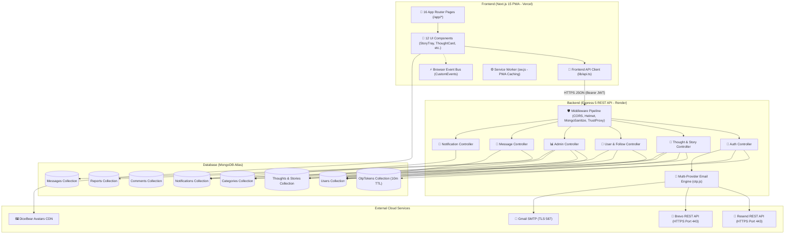

# 🌟 ThoughtShare — The Ultimate Full-Stack Master Architecture & Documentation (A to Z)

> **ThoughtShare** is a production-grade, mobile-first **Progressive Web App (PWA)** and editorial social publishing platform built with **Next.js 15 (App Router) + React 19 + TypeScript** on the frontend, and **Node.js (ES Modules) + Express 5 + MongoDB (Mongoose 8 ODM)** on the backend.

- 🌐 **Live Web Application (Vercel)**: [https://share-your-thought-eight.vercel.app/](https://share-your-thought-eight.vercel.app/)
- ⚙️ **Live Backend API (Render)**: [https://shareyourthought-1.onrender.com](https://shareyourthought-1.onrender.com)
- 📦 **GitHub Repository**: [https://github.com/muzamilCodes/ShareYourThought](https://github.com/muzamilCodes/ShareYourThought)

---

## 📑 Complete Table of Contents
1. [Full-Stack Architecture & High-Level Flow](#1-full-stack-architecture--high-level-flow)
2. [Complete Page-to-API-to-Database Mapping (A to Z)](#2-complete-page-to-api-to-database-mapping-a-to-z)
3. [Database Schemas & Mongoose Models (Field-by-Field)](#3-database-schemas--mongoose-models-field-by-field)
4. [Core Subsystems & Mechanics](#4-core-subsystems--mechanics)
   - [24-Hour Story Sparks & In-Story Deletion](#41-24-hour-story-sparks--in-story-deletion)
   - [Multi-Tier Algorithmic Feed Ranking & Dynamic Rotation](#42-multi-tier-algorithmic-feed-ranking--dynamic-rotation)
   - [Email Deliverability Engine (Resend + Brevo + SMTP)](#43-email-deliverability-engine-resend--brevo--smtp)
   - [In-Feed Suggested Creators System](#44-in-feed-suggested-creators-system)
   - [Admin Command Center & Platform Moderation](#45-admin-command-center--platform-moderation)
   - [Progressive Web App (PWA) & Offline Engine](#46-progressive-web-app-pwa--offline-engine)
   - [Client-Side Image Compression (Canvas Engine)](#47-client-side-image-compression-canvas-engine)
5. [Complete REST API Reference (Request & Response)](#5-complete-rest-api-reference)
6. [Cross-Component Event Bus (Frontend)](#6-cross-component-event-bus-frontend)
7. [Environment Variables Reference](#7-environment-variables-reference)
8. [Local Development Setup Guide](#8-local-development-setup-guide)
9. [Production Cloud Deployment Guide (Vercel + Render)](#9-production-cloud-deployment-guide-vercel--render)

---

## 1. Full-Stack Architecture & High-Level Flow

The ThoughtShare ecosystem is split into two independent, decoupled services that communicate via secure HTTPS JSON requests.



---

## 2. Complete Page-to-API-to-Database Mapping (A to Z)

Every single page on the frontend maps directly to specific backend endpoints, controllers, and MongoDB collections:

| # | Frontend Page (`/app/*`) | Core Components Used | Backend API Endpoint Hit | Controller Invoked | Database Collections & Fields Modified | Permissions |
|---|---|---|---|---|---|---|
| **1** | `app/page.tsx`<br>*(Home Feed)* | `StoryTray.tsx`<br>`CreateThought.tsx`<br>`ThoughtCard.tsx`<br>`MobileSuggestedUsers.tsx`<br>`InstagramRightRail.tsx` | `GET /api/thoughts?sort=...`<br>`GET /api/thoughts/stories/active`<br>`GET /api/users/suggested`<br>`GET /api/categories` | `thoughtController.getThoughts`<br>`thoughtController.getStories`<br>`userController.getSuggestedUsers` | Reads `Thoughts` (excludes `isStory: true`), `Users`, `Categories`. Updates `viewsCount` on view. | **Public / User** |
| **2** | `app/create/page.tsx`<br>*(Create Post/Story)* | `CreateThought.tsx`<br>`imageUtils.ts` (Canvas) | `POST /api/thoughts`<br>`GET /api/categories` | `thoughtController.createThought` | Creates document in `Thoughts` (`isStory`, `storyExpiresAt`, `gradient`, `imageUrl`). Increments `thoughtCount` in `Categories`. | **Logged-In User** |
| **3** | `app/thought/[id]/page.tsx`<br>*(Thought Detail)* | `ThoughtCard.tsx`<br>`CommentItem.tsx` | `GET /api/thoughts/:id`<br>`GET /api/comments/thoughts/:id`<br>`POST /api/comments/thoughts/:id`<br>`POST /api/likes/thoughts/:id` | `thoughtController.getThought`<br>`commentController.getComments`<br>`commentController.createComment`<br>`likeController.toggleLikeThought` | Reads `Thoughts`. Creates `Comments` (with `parentComment` for threaded replies). Updates `likes` array and creates `Notifications`. | **Public / User** |
| **4** | `app/profile/[username]/page.tsx`<br>*(Profile Page)* | `ProfileCard.tsx`<br>`ThoughtCard.tsx` | `GET /api/users/:username`<br>`POST /api/follows/:userId`<br>`GET /api/users/:username/followers`<br>`GET /api/users/:username/following` | `userController.getProfile`<br>`followController.toggleFollowUser` | Reads `Users` & `Thoughts`. Updates `followers`, `following`, or `followRequests` (if `isPrivate: true`). Creates `Notifications`. | **Public / User** |
| **5** | `app/explore/page.tsx`<br>*(Explore Topics)* | `ThoughtCard.tsx`<br>`SectionHeading.tsx` | `GET /api/thoughts/explore/all`<br>`GET /api/thoughts/trending/top`<br>`GET /api/categories` | `thoughtController.getExploreThoughts`<br>`thoughtController.getTrendingThoughts` | Reads `Thoughts` ranked by gravity score ($(\text{Engagement})/(\text{Age}+2)^{1.3}$) and `Categories`. | **Public / User** |
| **6** | `app/category/[slug]/page.tsx`<br>*(Category Stream)* | `ThoughtCard.tsx` | `GET /api/thoughts/category/:slug` | `thoughtController.getThoughtByCategory` | Queries `Thoughts` where `category == slug` and `isStory != true`. | **Public / User** |
| **7** | `app/notifications/page.tsx`<br>*(Notification Inbox)* | `NotificationItem.tsx` | `GET /api/notifications`<br>`PATCH /api/notifications/read-all` | `notificationController.getNotifications`<br>`notificationController.markAllAsRead` | Reads and updates `Notifications` where `recipient == user._id` (`read: true`). | **Logged-In User** |
| **8** | `app/messages/page.tsx`<br>*(Direct Chat)* | `ChatBox.tsx`<br>`ConversationList.tsx` | `GET /api/messages/conversations`<br>`GET /api/messages/:userId`<br>`POST /api/messages/:userId` | `messageController.getConversations`<br>`messageController.getMessages`<br>`messageController.sendMessage` | Queries and inserts documents into `Messages` (`sender`, `recipient`, `content`, `read`). | **Logged-In User** |
| **9** | `app/bookmarks/page.tsx`<br>*(Saved Bookmarks)* | `ThoughtCard.tsx` | `GET /api/users/saved/thoughts` | `userController.getSavedThoughts` | Queries `Users.savedThoughts` and populates matching `Thoughts`. | **Logged-In User** |
| **10**| `app/settings/page.tsx`<br>*(Account Settings)* | `SettingsForm.tsx` | `PATCH /api/users/me`<br>`DELETE /api/users/me` | `userController.updateMe`<br>`userController.deleteAccount` | Updates `Users` (`name`, `bio`, `avatar`, `isPrivate`). Cascades deletes of `Thoughts` and `Comments` on account deletion. | **Logged-In User** |
| **11**| `app/admin/page.tsx`<br>*(Admin Command Center)* | `SocialActivityTimeline.tsx`<br>`AdminStatsCard.tsx`<br>`UserManagementTable.tsx` | `GET /api/admin/stats`<br>`GET /api/admin/users`<br>`PATCH /api/admin/users/:id/role`<br>`DELETE /api/admin/users/:id` | `adminController.getAdminStats`<br>`adminController.listUsers`<br>`adminController.updateUserRole`<br>`adminController.deleteUser` | Aggregates all collections (`Users`, `Thoughts`, `Comments`, `Categories`). Updates `User.role` (`admin`/`user`) or permanently removes users. | **Admin Only (`role: 'admin'`)** |
| **12**| `app/login/page.tsx`<br>*(Login Portal)* | `AuthForm.tsx` | `POST /api/auth/send-login-otp`<br>`POST /api/auth/verify-login-otp`<br>`POST /api/auth/login` | `authController.sendLoginOtp`<br>`authController.verifyLoginOtp`<br>`authController.login` | Queries `Users`, creates/verifies `OtpTokens`, signs and returns signed JWT token. | **Public / Guest** |
| **13**| `app/register/page.tsx`<br>*(Registration)* | `AuthForm.tsx` | `POST /api/auth/send-register-otp`<br>`POST /api/auth/verify-register-otp` | `authController.sendRegisterOtp`<br>`authController.verifyRegisterOtp` | Validates uniqueness in `Users`, creates/verifies `OtpTokens`, inserts new `User`, returns signed JWT. | **Public / Guest** |
| **14**| `app/forgot-password/page.tsx`<br>*(Password Reset)* | `AuthForm.tsx` | `POST /api/auth/forgot-password`<br>`POST /api/auth/reset-password` | `authController.forgotPassword`<br>`authController.resetPassword` | Validates email, creates `OtpTokens`, updates hashed `password` in `Users`. | **Public / Guest** |
| **15**| `app/stats/page.tsx`<br>*(Public Stats)* | `TradingTimelineChart.tsx` | `GET /api/thoughts/stats/summary` | `thoughtController.getPlatformStats` | Aggregates counts: `totalThoughts`, `totalUsers`, `totalViews`, `totalLikes`, `totalComments`. | **Public / User** |
| **16**| `app/search/page.tsx`<br>*(Universal Search)* | `ThoughtCard.tsx`<br>`UserCard.tsx` | `GET /api/thoughts/search?q=...`<br>`GET /api/users/search?q=...` | `thoughtController.searchThoughts`<br>`userController.searchUsers` | Regex search over `Thoughts.content`, `Thoughts.hashtags`, `Users.name`, and `Users.username`. | **Public / User** |
| **17**| `app/offline/page.tsx`<br>*(PWA Offline)* | `OfflineState.tsx` | *None (Client Cache)* | *Service Worker (`sw.js`)* | Served automatically by `public/sw.js` when device loses internet connection. | **Public / All** |

---

## 3. Database Schemas & Mongoose Models (Field-by-Field)

### 1. `Thought` Model (`backend/src/models/Thought.js`)
Represents both standard posts and 24-hour Story Sparks.
```javascript
const thoughtSchema = new mongoose.Schema({
  author: { type: mongoose.Schema.Types.ObjectId, ref: 'User', required: true, index: true },
  content: { type: String, required: true, trim: true, maxlength: 2000 },
  imageUrl: { type: String, default: '' },
  category: { type: String, default: 'life', lowercase: true, index: true },
  hashtags: [{ type: String, lowercase: true, trim: true }],
  visibility: { type: String, enum: ['public', 'followers'], default: 'public' },
  likes: [{ type: mongoose.Schema.Types.ObjectId, ref: 'User' }],
  viewsCount: { type: Number, default: 0, index: true },
  sharesCount: { type: Number, default: 0 },
  featured: { type: Boolean, default: false },

  // --- 24-Hour Story Spark Subsystem Fields ---
  isStory: { type: Boolean, default: false, index: true },
  storyExpiresAt: { type: Date, default: null, index: true },
  gradient: { type: String, default: '' }
}, { timestamps: true });
```

### 2. `User` Model (`backend/src/models/User.js`)
```javascript
const userSchema = new mongoose.Schema({
  name: { type: String, required: true, trim: true },
  username: { type: String, required: true, unique: true, lowercase: true, trim: true, index: true },
  email: { type: String, required: true, unique: true, lowercase: true, trim: true, index: true },
  password: { type: String, required: true, select: false },
  avatar: { type: String, default: '' },
  bio: { type: String, default: '', maxlength: 500 },
  role: { type: String, enum: ['user', 'admin'], default: 'user' },
  isPrivate: { type: Boolean, default: false },
  followers: [{ type: mongoose.Schema.Types.ObjectId, ref: 'User' }],
  following: [{ type: mongoose.Schema.Types.ObjectId, ref: 'User' }],
  followRequests: [{ type: mongoose.Schema.Types.ObjectId, ref: 'User' }],
  savedThoughts: [{ type: mongoose.Schema.Types.ObjectId, ref: 'Thought' }]
}, { timestamps: true });
```

### 3. `Comment` Model (`backend/src/models/Comment.js`)
```javascript
const commentSchema = new mongoose.Schema({
  thought: { type: mongoose.Schema.Types.ObjectId, ref: 'Thought', required: true, index: true },
  author: { type: mongoose.Schema.Types.ObjectId, ref: 'User', required: true },
  content: { type: String, required: true, trim: true, maxlength: 1000 },
  parentComment: { type: mongoose.Schema.Types.ObjectId, ref: 'Comment', default: null },
  likes: [{ type: mongoose.Schema.Types.ObjectId, ref: 'User' }]
}, { timestamps: true });
```

### 4. `Notification` Model (`backend/src/models/Notification.js`)
```javascript
const notificationSchema = new mongoose.Schema({
  recipient: { type: mongoose.Schema.Types.ObjectId, ref: 'User', required: true, index: true },
  actor: { type: mongoose.Schema.Types.ObjectId, ref: 'User', required: true },
  type: { type: String, enum: ['like', 'comment', 'reply', 'follow', 'follow_request', 'system'], required: true },
  thought: { type: mongoose.Schema.Types.ObjectId, ref: 'Thought', default: null },
  comment: { type: mongoose.Schema.Types.ObjectId, ref: 'Comment', default: null },
  read: { type: Boolean, default: false, index: true }
}, { timestamps: true });
```

### 5. `OtpToken` Model (`backend/src/models/OtpToken.js`)
```javascript
const otpTokenSchema = new mongoose.Schema({
  email: { type: String, required: true, lowercase: true, index: true },
  code: { type: String, required: true },
  purpose: { type: String, enum: ['registration', 'login', 'password-reset'], required: true },
  expiresAt: { type: Date, required: true, index: { expires: '10m' } }
}, { timestamps: true });
```

### 6. `Message` Model (`backend/src/models/Message.js`)
```javascript
const messageSchema = new mongoose.Schema({
  sender: { type: mongoose.Schema.Types.ObjectId, ref: 'User', required: true, index: true },
  recipient: { type: mongoose.Schema.Types.ObjectId, ref: 'User', required: true, index: true },
  content: { type: String, required: true, trim: true, maxlength: 2000 },
  read: { type: Boolean, default: false }
}, { timestamps: true });
```

---

## 4. Core Subsystems & Mechanics

### 4.1. 24-Hour Story Sparks & In-Story Deletion

1. **Creation**:
   - In `StoryCreatorModal.tsx` or `CreateThought.tsx`, when `isStory` is checked, the payload sends `{ isStory: true, gradient, imageUrl, content }`.
   - The backend controller calculates:
     ```javascript
     storyExpiresAt = new Date(Date.now() + 24 * 60 * 60 * 1000); // exactly 24h
     ```
2. **Feed Segregation**:
   - `getThoughts` filters with `{ isStory: { $ne: true } }` so stories never mix into the general feed.
3. **Retrieval**:
   - `GET /api/thoughts/stories/active` queries `{ isStory: true, storyExpiresAt: { $gt: new Date() } }`.
4. **Display (100% Uncropped Image)**:
   - `StoryViewer.tsx` displays the photo with `object-fit: contain !important;` so 100% of the image and text is visible.
   - A blurred ambient backdrop (`filter: blur(28px) brightness(0.55)`) fills the surrounding screen.
5. **In-Story Delete Modal**:
   - Tapping `🗑️ Delete` pauses the timer and opens the custom in-story confirmation modal.
   - Tapping `Yes, Delete Story` invokes `DELETE /api/thoughts/:id`, reactively updates state, advances or closes the story player, and refreshes `StoryTray`.

---

### 4.2. Multi-Tier Algorithmic Feed Ranking & Dynamic Rotation

Every feed request executes ranking in `thoughtController.js`:

```javascript
// Priority Tiers:
// Tier 3: Your own posts (Always #1 / First in feed)
// Tier 2: Followed creators' posts (Always #2 / Top priority for followers)
// Tier 1: General discovery creators
const aTier = isSelf(a) ? 3 : isFollowed(a) ? 2 : 1;
const bTier = isSelf(b) ? 3 : isFollowed(b) ? 2 : 1;

if (aTier !== bTier) return bTier - aTier;

// For Discovery Tier (Trending Mode):
// Score = (Likes*5 + Comments*4 + Saves*4 + Views*1) / (AgeInHours + 2)^1.3
return thoughtScore(b) - thoughtScore(a);
```

- **Dynamic Refresh Rotation**: Refreshes blend virality scores with time decay, rotating discovery content on each page reload.

---

### 4.3. Email Deliverability Engine (Resend + Brevo + SMTP)

Located in `backend/src/utils/otp.js`:

1. **Stage 1 (Resend REST API)**: Direct HTTPS call to `https://api.resend.com/emails` (Port 443). Bypasses all ISP SMTP port blocking.
2. **Stage 2 (Brevo REST API)**: HTTPS call to `https://api.brevo.com/v3/smtp/email` if Resend is unavailable.
3. **Stage 3 (SMTP Pool)**: Fallback connecting to Gmail or Hostinger with automated pooling.

---

### 4.4. In-Feed Suggested Creators System

- Rendered by `MobileSuggestedUsers.tsx` inside the feed stream **after the 2nd thought**.
- Automatically filters out creators you already follow:
  ```typescript
  const unfollowedUsers = users.filter((u) => !followingMap[u._id]);
  ```
- Includes a clean `✕` dismiss button so users can close it anytime.

---

### 4.5. Admin Command Center & Platform Moderation

- Path: `/app/admin/page.tsx` (Guarded by `session?.user?.role === 'admin'`).
- **Platform Analytics**: Total Users, Total Thoughts, Total Views, Likes, Shares, Active Categories.
- **Social Activity Timeline**: Interactive 14-day line chart displaying thoughts published, comments, and signups.
- **User Management Table**: Search users by name/email/username, filter by role, promote users to `admin`, demote admins to `user`, or permanently delete accounts with cascading thought cleanup.

---

### 4.6. Progressive Web App (PWA) & Offline Engine

- **Web Manifest (`public/manifest.json`)**: Configures app name, standalone display mode, theme colors (`#c86d34`), and responsive icons.
- **Service Worker (`public/sw.js`)**: Caches static JS/CSS bundles and fonts for instant load times.
- **Offline Fallback (`app/offline/page.tsx`)**: Renders an offline state screen with auto-reconnect listeners.

---

### 4.7. Client-Side Image Compression (Canvas Engine)

- Located in `frontend/lib/imageUtils.ts`.
- Automatically scales camera photos to max 1280px resolution and compresses JPEG quality to 0.78 using HTML5 Canvas.
- Reduces raw 12MB camera photos down to lightweight ~150KB Data URLs, enabling instant photo sharing on slow 4G/5G mobile connections.

---

## 5. Complete REST API Reference

### 🔐 Authentication (`/api/auth`)
| Method | Route | Body Payload | Response |
|---|---|---|---|
| `POST` | `/api/auth/send-register-otp` | `{ name, email, password }` | `{ success: true, message: "OTP sent" }` |
| `POST` | `/api/auth/verify-register-otp`| `{ email, code }` | `{ token: "jwt...", user: { ... } }` |
| `POST` | `/api/auth/send-login-otp` | `{ email }` | `{ success: true, message: "OTP sent" }` |
| `POST` | `/api/auth/verify-login-otp` | `{ email, code }` | `{ token: "jwt...", user: { ... } }` |
| `POST` | `/api/auth/login` | `{ email, password }` | `{ token: "jwt...", user: { ... } }` |
| `GET` | `/api/auth/me` | *None* (Header `Bearer <token>`) | `{ user: { ... } }` |

### ✍️ Thoughts & Stories (`/api/thoughts`)
| Method | Route | Body Payload / Params | Response |
|---|---|---|---|
| `GET` | `/api/thoughts` | Query: `sort=trending&page=1&limit=20` | `{ thoughts: [...], total, page }` |
| `GET` | `/api/thoughts/stories/active` | *None* | `{ stories: [...] }` |
| `POST` | `/api/thoughts` | `{ content, imageUrl, category, hashtags, isStory, gradient }` | `{ thought: { ... } }` |
| `GET` | `/api/thoughts/:id` | *None* | `{ thought: { ... } }` |
| `PATCH`| `/api/thoughts/:id` | `{ content, category, visibility }` | `{ thought: { ... } }` |
| `DELETE`| `/api/thoughts/:id` | *None* (Bearer Token) | `{ message: "Thought deleted successfully" }` |
| `POST` | `/api/thoughts/:id/view` | *None* | `{ views: 142 }` |
| `POST` | `/api/thoughts/:id/save` | *None* (Bearer Token) | `{ saved: true, saves: 12 }` |

### 👥 Users & Follows (`/api/users` & `/api/follows`)
| Method | Route | Body Payload / Params | Response |
|---|---|---|---|
| `GET` | `/api/users/:username` | *None* | `{ profile: { ... }, thoughts: [...] }` |
| `GET` | `/api/users/suggested` | *None* | `{ users: [...] }` |
| `PATCH`| `/api/users/me` | `{ name, bio, avatar, isPrivate }` | `{ user: { ... } }` |
| `POST` | `/api/follows/:userId` | *None* (Bearer Token) | `{ following: true, requested: false }` |
| `GET` | `/api/follows/requests` | *None* | `{ requests: [...] }` |

### 🛡️ Admin Management (`/api/admin`)
| Method | Route | Body Payload / Params | Response |
|---|---|---|---|
| `GET` | `/api/admin/stats` | *None* (Admin Token) | `{ totalUsers, totalThoughts, totalViews, ... }` |
| `GET` | `/api/admin/users` | Query: `page=1&limit=20&search=...` | `{ items: [...], total, page }` |
| `PATCH`| `/api/admin/users/:id/role`| `{ role: "admin" }` | `{ user: { ... } }` |
| `DELETE`| `/api/admin/users/:id` | *None* (Admin Token) | `{ message: "User deleted" }` |

---

## 6. Cross-Component Event Bus (Frontend)

The frontend uses custom DOM event listeners to update UI state instantly without reloading:
- `thought-created`: Dispatched on thought publish; re-fetches feed and boosts post to #1.
- `story-created`: Dispatched on story creation or story deletion; re-fetches `StoryTray`.
- `follow-status-updated`: Dispatched on follow/unfollow; re-ranks feed and updates suggested creators.
- `unread-count-updated`: Dispatched on notification check; updates badge counts on top Navbar & mobile BottomNav.

---

## 7. Environment Variables Reference

### Backend (`backend/.env`)
```env
PORT=5000
NODE_ENV=production
MONGO_URI=mongodb+srv://<username>:<password>@cluster0.mongodb.net/thoughtshare?retryWrites=true&w=majority
JWT_SECRET=your_super_secret_jwt_key_here
JWT_EXPIRES_IN=30d
CLIENT_URL=https://share-your-thought-eight.vercel.app

# Multi-Provider Email Keys (Any 1 or more)
RESEND_API_KEY=re_xxxxxxxxxxxxxxxxxxxxxxxx
BREVO_API_KEY=xkeysib-xxxxxxxxxxxxxxxxxxxx
EMAIL_FROM=ThoughtShare <onboarding@resend.dev>

# Optional SMTP Fallback
SMTP_HOST=smtp.gmail.com
SMTP_PORT=587
SMTP_USER=your_email@gmail.com
SMTP_PASS=your_app_password
```

### Frontend (`frontend/.env.local`)
```env
NEXT_PUBLIC_API_URL=https://shareyourthought-1.onrender.com/api
NEXT_PUBLIC_APP_URL=https://share-your-thought-eight.vercel.app
```

---

## 8. Local Development Setup Guide

### Step 1: Clone Repository
```bash
git clone https://github.com/muzamilCodes/ShareYourThought.git
cd ShareYourThought
```

### Step 2: Run Backend
```bash
cd backend
npm install
# Ensure .env is populated with MONGO_URI and JWT_SECRET
npm run dev
```
Backend API will run on `http://localhost:5000`.

### Step 3: Run Frontend
```bash
cd ../frontend
npm install
# Ensure .env.local has NEXT_PUBLIC_API_URL=http://localhost:5000/api
npm run dev
```
Frontend Web App will open on `http://localhost:3000`.

---

## 9. Production Cloud Deployment Guide (Vercel + Render)

### Backend on Render:
1. Create a **Web Service** on [Render.com](https://render.com).
2. Set Root Directory to `backend`.
3. Build Command: `npm install`
4. Start Command: `npm start`
5. Under **Environment**, add all variables from `backend/.env`.

### Frontend on Vercel:
1. Import repository on [Vercel.com](https://vercel.com).
2. Set Root Directory to `frontend`.
3. Under **Environment Variables**, add `NEXT_PUBLIC_API_URL=https://<your-render-backend>.onrender.com/api`.
4. Click **Deploy**.
